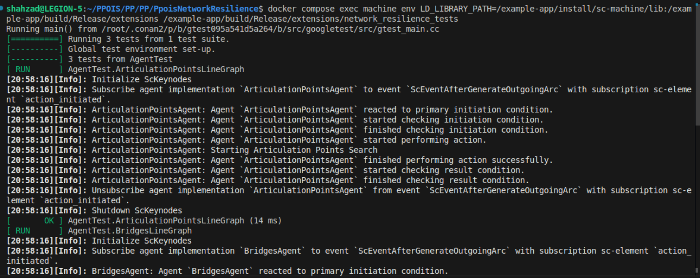
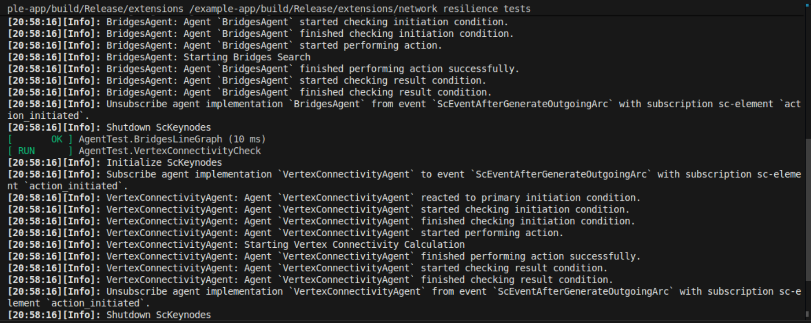
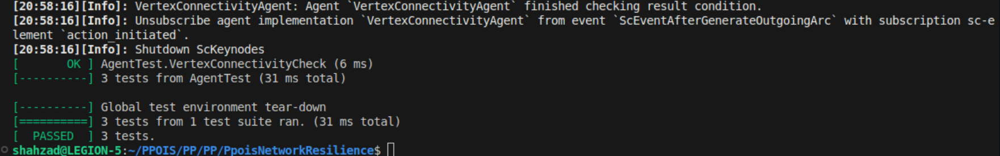

# Отчёт по расчётной работе

**Дисциплина:** Проектирование программного обеспечения интеллектуальных систем  
**Вариант:** 6 — Анализ отказоустойчивости корпоративной сети  

---

## 1. Цель работы

Разработать программный модуль для платформы OSTIS, реализующий анализ топологии корпоративной сети на отказоустойчивость.

---

## 2. Постановка задачи

В соответствии с вариантом задания необходимо реализовать следующие функции:

| № | Функция | Описание |
|---|---------|----------|
| 1 | Поиск точек сочленения | Определение вершин графа, удаление которых приводит к потере связности сети |
| 2 | Поиск мостов | Определение рёбер графа, удаление которых приводит к потере связности сети |
| 3 | Определение вершинной связности | Проверка связности графа сети |

---

## 3. Используемые технологии

| Компонент | Технология |
|-----------|------------|
| Платформа | OSTIS (Open Semantic Technology for Intelligent Systems) |
| Язык представления знаний | SCs (Semantic Code system) |
| Язык разработки агентов | C++ |
| Контейнеризация | Docker, Docker Compose |
| Тестирование | Google Test (GTest) |

---

## 4. Архитектура решения

### 4.1 Структура модуля

```
problem-solver/cxx/network_resilience_module/
├── agents/
│   ├── articulation_points_agent.cpp
│   ├── articulation_points_agent.hpp
│   ├── bridges_agent.cpp
│   ├── bridges_agent.hpp
│   ├── vertex_connectivity_agent.cpp
│   └── vertex_connectivity_agent.hpp
├── keynodes/
│   └── resilience_keynodes.hpp
├── test/
│   └── test_resilience.cpp
├── network_resilience_module.cpp
├── network_resilience_module.hpp
└── CMakeLists.txt
```

### 4.2 База знаний

```
knowledge-base/network-domain/
├── network_domain.scs    # Определение предметной области
└── test_network.scs      # Тестовая сеть для проверки
```

---

## 5. Описание реализованных агентов

### 5.1 Агент поиска точек сочленения

**Класс:** `ArticulationPointsAgent`  
**Действие:** `action_find_articulation_points`  
**Алгоритм:** Поиск в глубину (DFS) с вычислением времён входа и минимальных достижимых вершин.

### 5.2 Агент поиска мостов

**Класс:** `BridgesAgent`  
**Действие:** `action_find_bridges`  
**Алгоритм:** Поиск в глубину (DFS) с определением рёбер, удаление которых увеличивает число компонент связности.

### 5.3 Агент определения связности

**Класс:** `VertexConnectivityAgent`  
**Действие:** `action_find_vertex_connectivity`  
**Алгоритм:** Поиск в ширину (BFS) для проверки достижимости всех вершин из начальной.

---

## 6. Инструкция по запуску

### 6.1 Предварительные требования

- Установленный Docker
- Установленный Docker Compose

### 6.2 Запуск системы

```bash
cd PpoisNetworkResilience
docker compose up -d
```

### 6.3 Остановка системы

```bash
docker compose down
```

---

## 7. Тестирование

### 7.1 Команда запуска тестов

```bash
docker compose exec machine env \
  LD_LIBRARY_PATH=/example-app/install/sc-machine/lib:/example-app/build/Release/extensions \
  /example-app/build/Release/extensions/network_resilience_tests
```

### 7.2 Результаты тестирования

**Рисунок 1.** Запуск тестов  


**Рисунок 2.** Выполнение тестов агентов  


**Рисунок 3.** Результат выполнения тестов  


### 7.3 Перечень тестов

| Тест | Описание | Ожидаемый результат |
|------|----------|---------------------|
| `ArticulationPointsLineGraph` | Линейный граф A—B—C | Точка сочленения: B |
| `BridgesLineGraph` | Линейный граф A—B—C | Мосты: A—B, B—C |
| `VertexConnectivityCheck` | Связный граф A—B | Статус: Connected |

---

## 8. Заключение

В ходе выполнения расчётной работы был разработан программный модуль для платформы OSTIS, реализующий анализ отказоустойчивости корпоративной сети.

### Основные результаты:

1. Разработан модуль `network_resilience_module`, интегрированный в платформу OSTIS.
2. Реализованы три агента для анализа топологии сети:
   - Агент поиска точек сочленения (алгоритм DFS)
   - Агент поиска мостов (алгоритм DFS)
   - Агент определения связности (алгоритм BFS)
3. Создана онтология предметной области, описывающая типы сетевых устройств и отношения между ними.
4. Разработаны модульные тесты, подтверждающие корректность работы алгоритмов.

### Выводы:

- Использование платформы OSTIS позволяет эффективно представлять топологию сети в виде семантического графа.
- Агентный подход обеспечивает модульность и расширяемость системы.
- Реализованные алгоритмы позволяют выявлять критические элементы сетевой инфраструктуры для повышения отказоустойчивости.

---

## 9. Список файлов проекта

| Файл | Назначение |
|------|------------|
| `network_resilience_module.hpp` | Заголовочный файл модуля |
| `network_resilience_module.cpp` | Регистрация агентов |
| `resilience_keynodes.hpp` | Определение ключевых узлов |
| `articulation_points_agent.cpp` | Реализация поиска точек сочленения |
| `bridges_agent.cpp` | Реализация поиска мостов |
| `vertex_connectivity_agent.cpp` | Реализация проверки связности |
| `network_domain.scs` | Онтология предметной области |
| `test_network.scs` | Тестовые данные |
| `test_resilience.cpp` | Модульные тесты |
